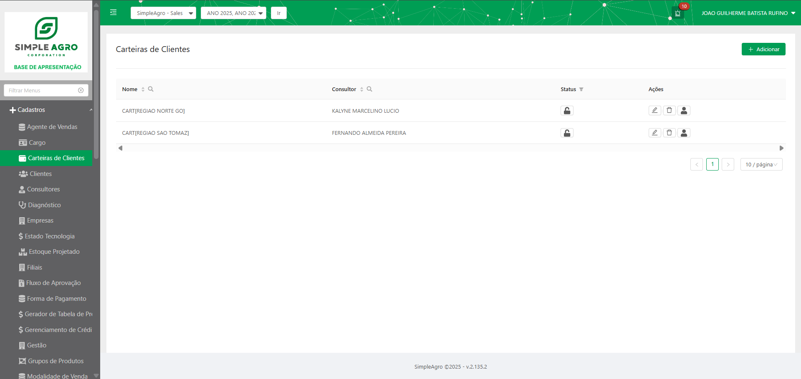
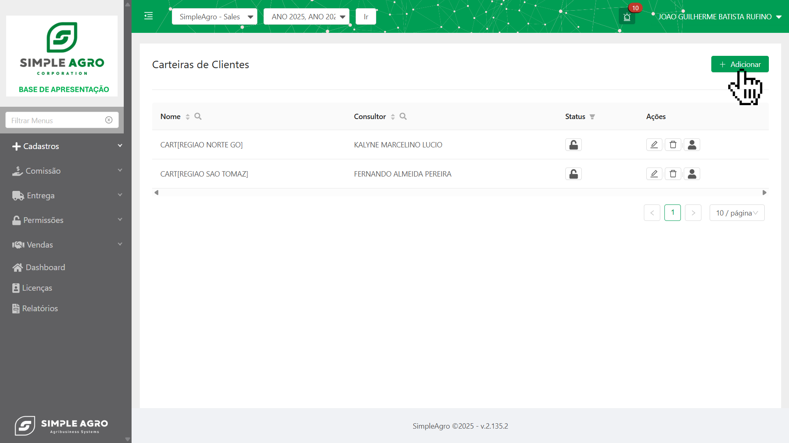
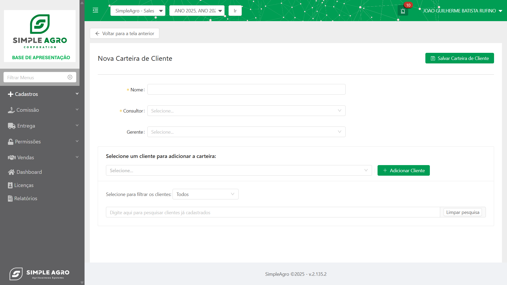
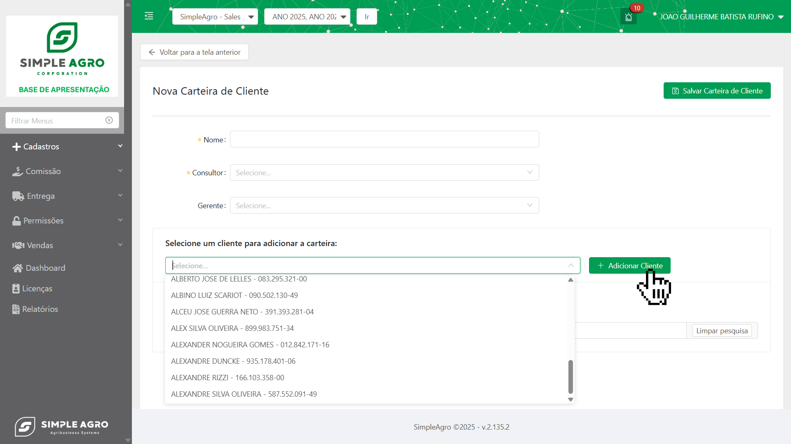
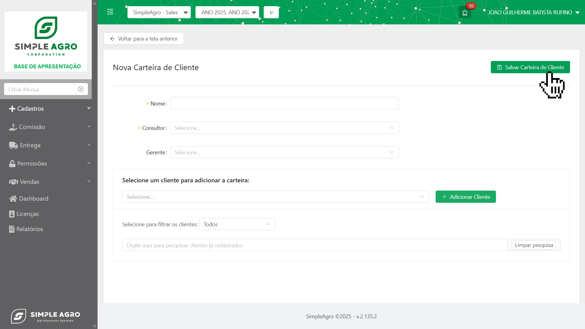

<Info>
  **Quer ir direto ao ponto?** Se você já conhece o sistema e quer apenas saber como criar uma carteira na prática, [**clique aqui para ir direto ao tutorial**](Carteiracliente#🤔-mas-como-criar-uma-carteira-na-prática%3F) de criação passo a passo\!
</Info>

## Funcionalidades Principais

### **Listagem e Organização**

A interface apresenta todas as carteiras cadastradas com informações sobre nome da carteira, consultor responsável e status atual. O sistema oferece filtros para localização rápida e organização das informações.

### Controle de Status

Cada carteira possui controle de ativação/desativação, permitindo gerenciar quais carteiras estão ativas no sistema sem perder o histórico de configurações anteriores.

<CardGroup cols={2}>
  <Card title="Editar" icon="pencil">
    Permite modificar as informações da carteira
  </Card>
  <Card title="Excluir" icon="trash-can">
    Permite remover a carteira do sistema
  </Card>
</CardGroup>

## Gestão de Clientes na Carteira

### Adição de Clientes

O sistema permite adicionar clientes às carteiras através de uma interface de busca que facilita a localização e seleção dos clientes desejados. É possível filtrar clientes por diferentes critérios para agilizar o processo de composição da carteira.

### Controle de Vinculação

Clientes podem ser adicionados ou removidos das carteiras conforme necessário, permitindo ajustes na distribuição territorial e reorganização da estrutura comercial.

<Info>
  O sistema oferece busca inteligente de clientes cadastrados, facilitando a localização e vinculação à carteira desejada.
</Info>

## 🤔 Mas como criar uma carteira na prática?

Agora que você conhece as funcionalidades, vamos ao passo a passo prático para criar sua primeira carteira no sistema:

<Note>
  **Importante:** Os campos e opções apresentados podem variar conforme as regras de negócio e configurações específicas da sua empresa. O processo base permanece o mesmo, mas a interface se adapta às suas necessidades.
</Note>

<Steps>
  <Step title="Acessando a Funcionalidade">
    Navegue até o menu Cadastros \> Carteiras de Clientes no menu lateral do sistema.
    
  </Step>
  <Step title="Iniciando a Criação">
    Clique no botão “Adicionar” localizado no canto superior direito da tela para iniciar o processo de criação de uma nova carteira.
    
  </Step>
  <Step title="Configurações Informações Básicas">
    Preencha o nome da carteira e selecione o consultor responsável. O sistema também permite definir gerentes e outros níveis hierárquicos conforme a estrutura da empresa.
    
  </Step>
  <Step title="Adicionando Clientes">
    Utilize a seção de busca de clientes para localizar e adicionar clientes à carteira. É possível filtrar os resultados e selecionar múltiplos clientes de uma vez. Clique em “Adicionar Cliente” para vincular cada cliente selecionado à carteira.
  
  </Step>
  <Step title="Finalizando">
    Após configurar todas as informações e adicionar os clientes desejados, clique em “Salvar Carteira de Cliente” para concluir a criação
    
  </Step>
</Steps>

<Note>
  **Dica importante:** Utilize os filtros de busca para localizar clientes específicos mais rapidamente, especialmente em bases de dados com muitos registros.
</Note>

<Warning>
  Certifique-se de salvar a carteira após todas as configurações. Clientes podem ser adicionados posteriormente através da edição da carteira.
</Warning>