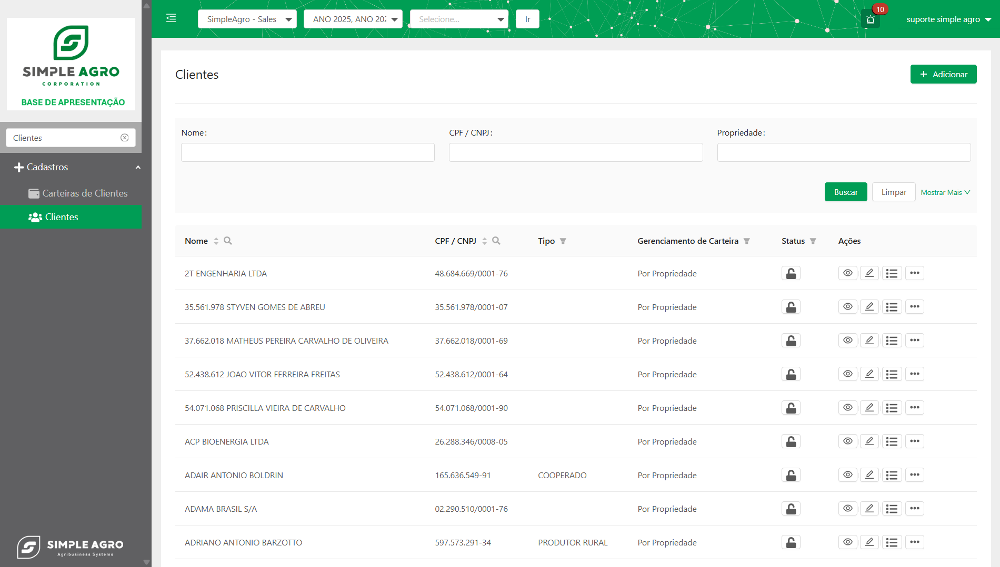
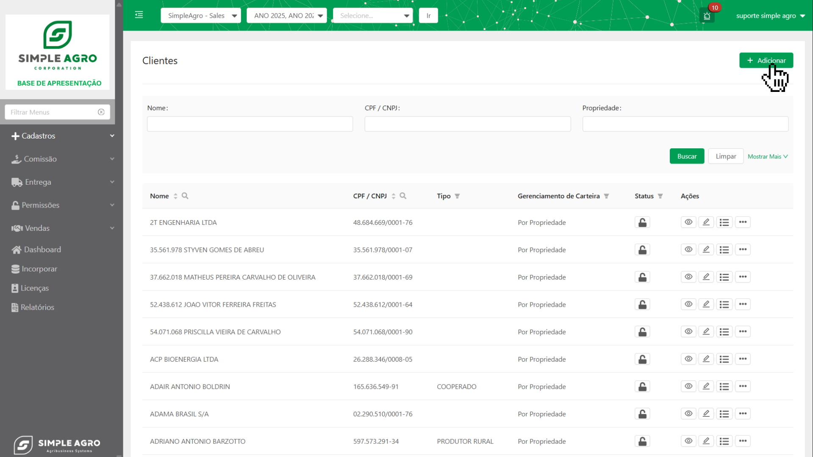
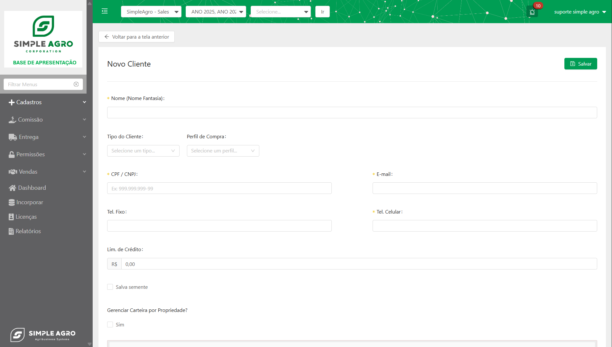
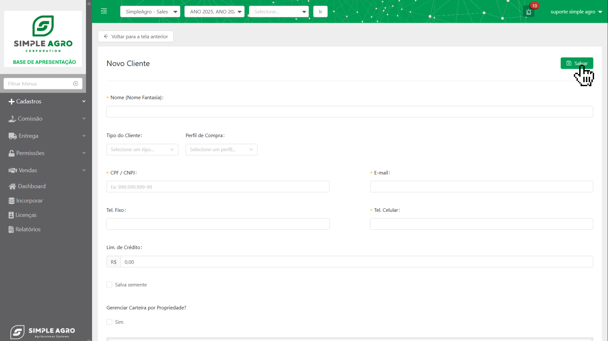

## Visão Geral da Tela de Clientes

A tela "Clientes" é o painel central para o cadastro de novos clientes. Seu objetivo principal é fornecer uma interface clara e eficiente para registrar as informações cruciais de cada cliente, permitindo uma gestão organizada e completa.

## Overview

Na visualização inicial dos clientes já cadastrados, o sistema exibe uma série de ações rápidas que podem ser acessadas diretamente na lista. Essas ações auxiliam na gestão prática dos registros existentes:

- **Nome:** Exibe o nome completo do cliente.
- **CPF/CNPJ:** Exibe o documento de identificação do cliente.
- **Tipo do Cliente:** Exibe o tipo do cliente vinculado.
- **Gerenciamento de Carteira:** Exibe o gerenciamento deste cliente.

  <CardGroup cols={1}>
    <Card title="Status" icon="lock" horizontal>
      Representado por um ícone de cadeado, este componente permite **ativar** ou  **desativar** um cliente. Apenas usuários com as permissões adequadas podem realizar esta ação.
    </Card>
  </CardGroup>

<CardGroup cols={2}>
  <Card title="Visualizar" icon="eye">
    Exibe os detalhes do cliente em modo somente leitura.
  </Card>
  <Card title="Editar" icon="pencil">
    Permite a modificação das informações do Cliente.
  </Card>
  <Card title="Veja as propriedades do cliente" icon="list">
    Mostra as propriedades vinculadas ao cliente.
  </Card>
  <Card title="Histórico Lim. Crédito" icon="clock-rotate-left">
    Apresenta o histórico de alterações no limite de crédito do cliente.
  </Card>
  <Card title="Excluir" icon="trash">
    Remove o cliente do sistema.
  </Card>
</CardGroup>

## Componentes da Tela de Clientes :

A tela "Novo Cliente" possui diversos campos para o registro completo das informações, a seguir estão os principais componentes:

- **Nome (Nome Fantasia)**: Insira o nome completo ou nome fantasia do cliente.
- **Tipo do Cliente**: Defina o tipo de cliente
- **Perfil de Compra**: Categorize o perfil de compra do cliente.
- **E-mail**: Informe o endereço de e-mail do cliente.
- **Lim. de Crédito**: Defina o limite de crédito disponível para o cliente.
- **Salva Semente**: Marque esta opção para indicar que o produtor rural guarda parte dos grãos colhidos para uso como semente na próxima safra.
  - Ao marcar esta opção, o campo **"Área Salva Semente"** será liberado, onde deve ser informado o percentual da área utilizada para esta prática.
- **Gerenciar Carteira por Propriedade?**: Opção para indicar se a carteira de clientes será gerenciada individualmente por propriedade.
- **Endereço**: Insira o endereço completo do cliente ou da propriedade, se aplicável.
- **Documentos**: Seção para adicionar documentos relacionados ao cliente. Permite incluir tipo, validade e anexar arquivos.

<Danger>
  **Atenção:** Certifique-se de que todas as informações estão corretas antes de salvar o cliente. Após a criação, algumas informações podem não ser editáveis.
</Danger>

## 🤔 Mas como criar um cliente?

Para criar um novo cliente no sistema, siga os passos abaixo:

<Steps>
  <Step title='Na tela "Clientes", clique no botão"+ Adicionar"'>
    Isso o levará para a tela "Novo Cliente".
    
    </img>
  </Step>
  <Step title="Preencha todas as informações relevantes do cliente.">
    
    </img>

    <Info>
      Se necessário, utilize a seção **"Documentos"** para anexar arquivos relevantes clicando em **"\+ Adicionar"**.
    </Info>
  </Step>
  <Step title='Após preencher todas as informações, clique no botão "Salvar" para registar o cliente'>
    
    </img>
  </Step>
</Steps>

## 🤔 E agora, como criar uma propriedade?
Após criar um cliente, o sistema vai exibir um tela perguntando se você deseja criar uma propriedade para o cliente recém-criado.
Se você optar por criar uma propriedade, siga os passos abaixo:

