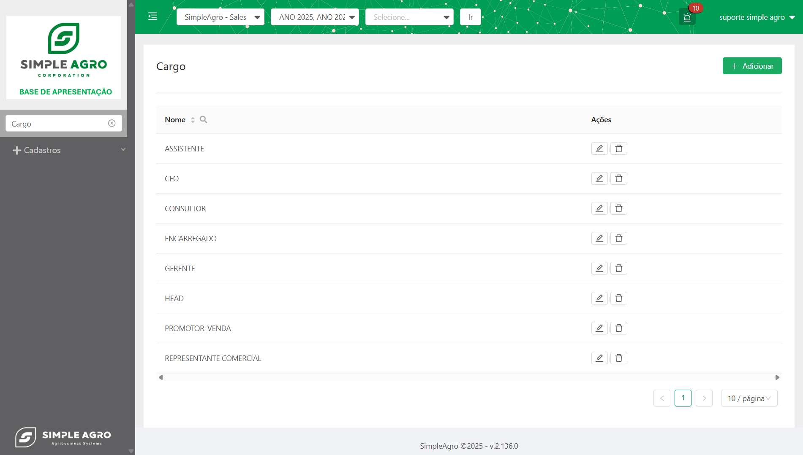
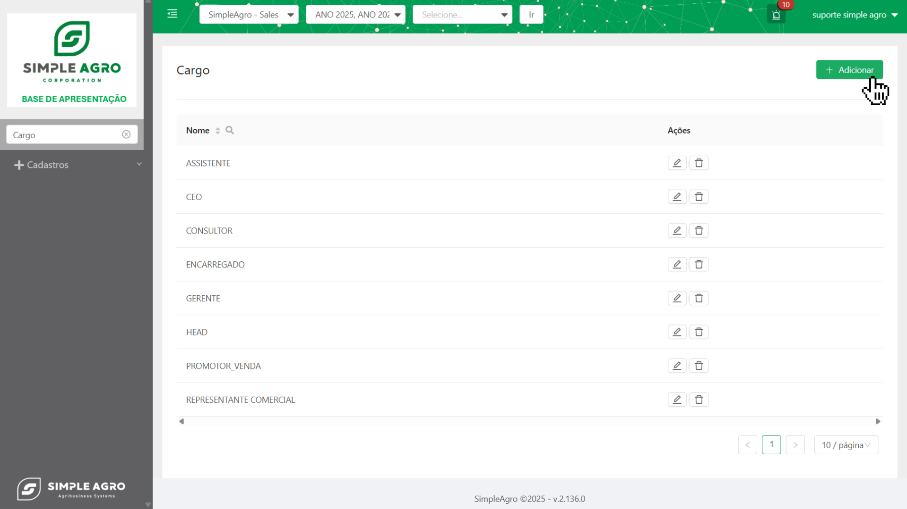
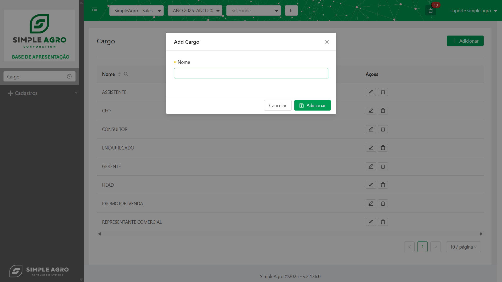
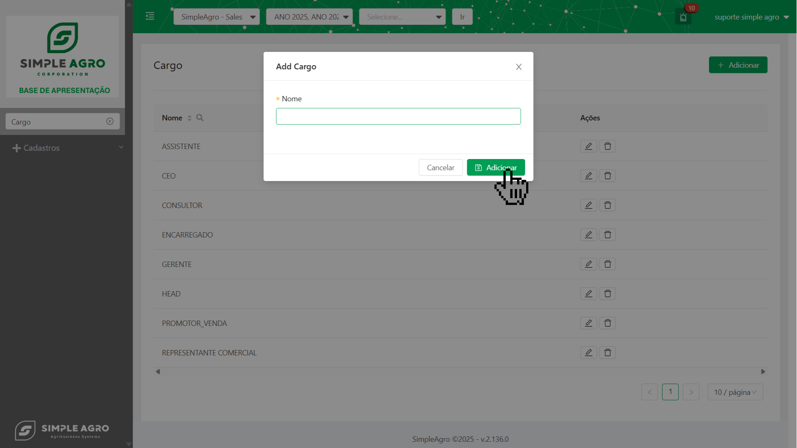

## Visão Geral da Tela de Cargo

A tela "Cargo" é o painel central para a administração de todos os cargos cadastrados no sistema. Seu objetivo principal é fornecer uma interface clara e eficiente para que os administradores possam gerenciar os diferentes tipos de cargos disponíveis para os usuários e consultores.

## Componentes da Tela de Cargo:

- **Nome**: Exibe o nome do cargo cadastrado.
- **Ações**: Esta coluna contém os botões para as seguintes operações:

<CardGroup cols={2}>
  <Card title="Editar" icon="pencil">
    Permite a modificação do cargo
  </Card>
  <Card title="Excluir" icon="trash-can">
    Remover o registro do cargo dentro do sistema.
  </Card>
</CardGroup>

<Warning>
  **Importante:** Mesmo após a exclusão de informações no painel, todos os registros são mantidos em ambiente seguro. Isso garante o histórico de informações e, em casos de exclusão inadequada, a possibilidade de restauração dos dados.
</Warning>

## 🤔 Como criar um novo Cargo?

Para cadastrar um novo cargo no sistema, siga os passos abaixo:

<Steps>
  <Step title='Na tela "Cargo", clique no botão "+ Adicionar" localizado no canto superior direito da tela.'>
    Isso abrirá uma janela pop-up, "Add Cargo", onde você poderá inserir o nome do novo cargo.
    
  </Step>
  <Step title='Preencha o campo "Nome" com a descrição do novo cargo.'>
  
  </Step>
  <Step title='Após preencher as informações, clique no botão "Adicionar" na janela pop-up para registrar o novo cargo no sistema.'>
    O novo cargo será listado na tabela da tela "Cargo".
    
  </Step>
</Steps>