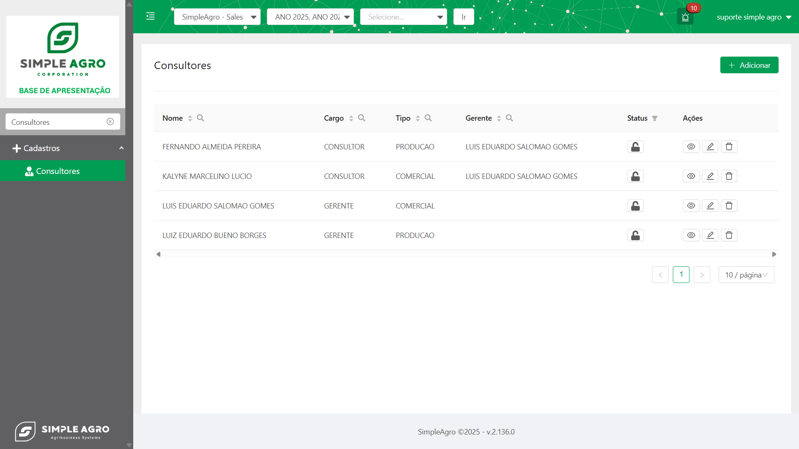
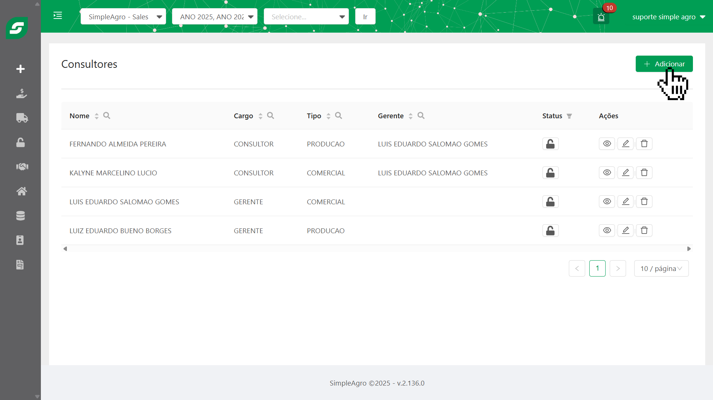
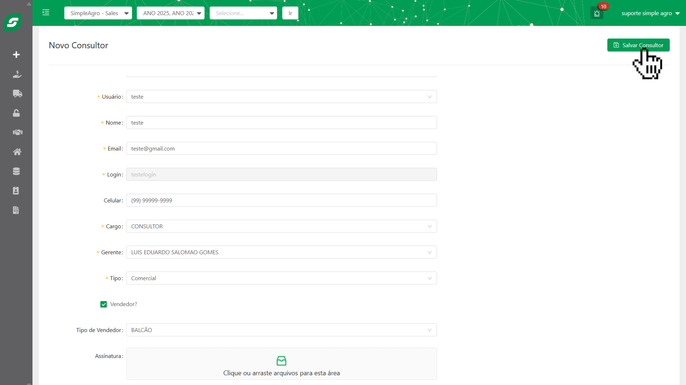

<Warning>
**Atenção:** Para cadastrar um novo consultor, é essencial que o usuário já esteja previamente registrado no sistema. Certifique-se de que o usuário existe antes de prosseguir com o vínculo.
</Warning>
<Info>
**Precisa cadastrar um usuário primeiro?** Temos um guia completo sobre como criar e gerenciar usuários no sistema. [Clique aqui para acessar o guia de criação de usuários.](/usuarios)
</Info>

## Visão Geral da Tela de Consultores

A tela "Consultores" é o painel central para a administração de todas as contas de consultores cadastradas no sistema. Seu objetivo principal é fornecer uma interface clara e eficiente para que os administradores possam gerenciar o acesso e as permissões dos consultores da equipe.

 

## Componentes da Tela de Consultores:

* **Nome**: Exibe o nome completo do consultor. 
* **Cargo**: Indica o cargo do consultor. 
* **Tipo**: Descreve o tipo de consultor. 
* **Gerente**: Mostra o gerente responsável pelo consultor. 
* **Status**: Representado por um ícone de cadeado, este componente permite **ativar** ou **desativar** um consultor. Apenas usuários com as permissões adequadas podem realizar esta ação.
  <CardGroup cols={1}>
    <Card title="Status" icon="lock">
      
    </Card>
  </CardGroup>

* **Ações**: Esta coluna contém botões para as seguintes operações:
<CardGroup cols={3}>
  <Card title="Visualizar" icon="eye" horizontal>
    
  </Card>
  <Card title="Editar" icon="pencil" horizontal>
    
  </Card>
  <Card title="Excluir" icon="trash" horizontal>
    
  </Card>
</CardGroup>

## 🤔 Mas como criar um consultor? 

Para cadastrar um novo consultor no sistema, siga os passos abaixo:

<Steps>
    <Step title='Na tela "Consultores", clique no botão "+ Adicionar" localizado no canto superior direito da tela.'>
        Isso o levará para a tela "Novo Consultor", onde você poderá inserir as informações necessárias para criar uma nova conta.
        
    </Step>

  <Step title='Após preencher as informações básicas, clique no botão "Salvar Consultor" para registrar.'>
      Isso o levará para a tela principal de consultores, onde você poderá verificar o consultor criado dentro do sistema utilizando a visualização da tabela juntamente com os filtros de busca.
        
  </Step>
</Steps>

