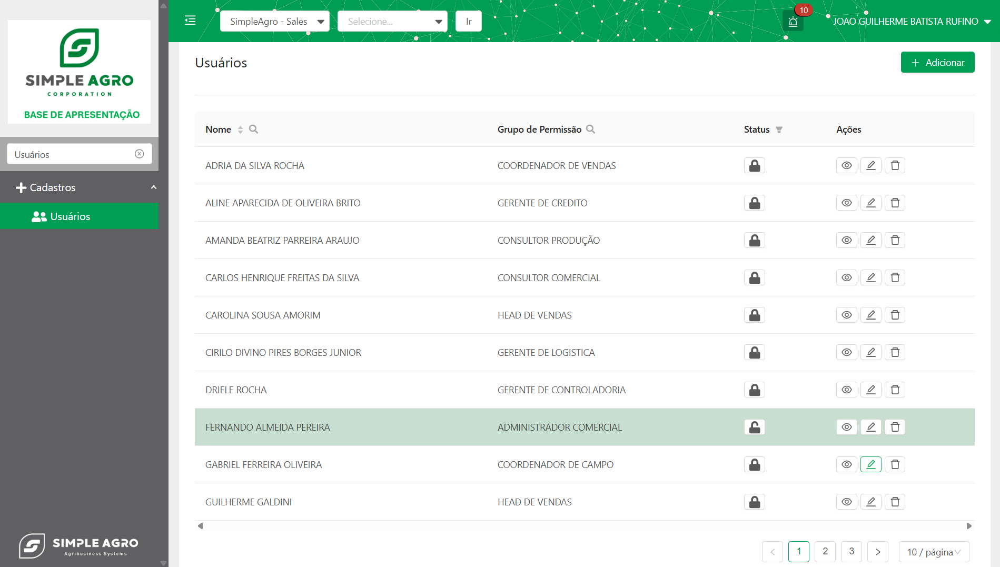
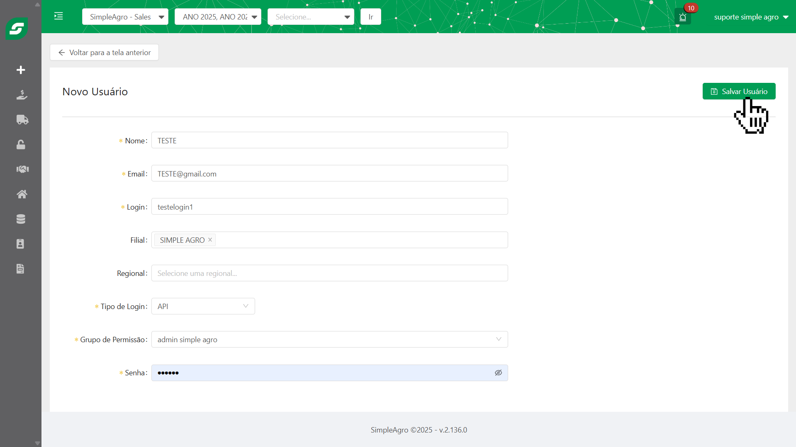

## Visão Geral da Tela de Usuários

A tela "Usuários" é o painel central para a administração de todas as contas de usuário cadastradas no sistema. Seu objetivo principal é fornecer uma interface clara e eficiente para que os administradores possam gerenciar o acesso e as permissões dos diferentes membros da equipe.
    

### Componentes da Tela de Usuários:

- **Nome:** Exibe o nome completo do usuário.
- **Grupo de Permissão:** Indica o grupo de permissão ao qual o usuário pertence, definindo suas capacidades dentro do sistema.
- **Status:** Representado por um ícone de cadeado, este componente permite **ativar** ou **desativar** um usuário. Apenas usuários com as permissões adequadas podem realizar esta ação.

  <CardGroup cols={1}>
    <Card title="Status" icon="lock">
      
    </Card>
  </CardGroup>
- **Ações:** Esta coluna contém os botões para as seguintes operações:

<CardGroup cols={3}>
  <Card title="Visualizar" icon="eye" horizontal>
    
  </Card>
  <Card title="Editar" icon="pencil" horizontal>
    
  </Card>
  <Card title="Excluir" icon="trash" horizontal>
    
  </Card>
</CardGroup>

## 🤔 Mas como criar um usuário?

Para criar um novo usuário no sistema, siga os passos abaixo:

<Steps>
  <Step title='Na tela "Usuários", clique no botão  + Adicionar" localizado no canto superior direito da tela.'>
    Isso o levará para a tela "Novo Usuário", onde você poderá inserir as informações necessárias para criar uma nova conta.
    
  </Step>
  <Step title='Após preenchimento das informações básicas, clique no botão "Salvar Usuário" para registrar'>
    Isso o levará para tela principal da tela de usuários, onde você poderá verificar o usuário criado dentro do sistema utilizando a visualização da tabela juntamente com os filtros de busca.
    
  </Step>

  
</Steps>
